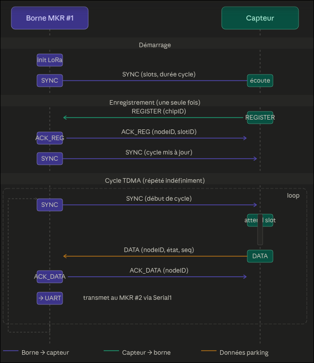

Avec deux MKR WAN 1310, l'idée est simple : chaque Arduino a un rôle unique et ils se parlent entre eux via un câble.

Capteurs ──LoRa P2P──▶ MKR #1 (récepteur P2P) ──UART──▶ MKR #2 (gateway LoRaWAN) ──LoRaWAN──▶ Serveur

MKR #1 tourne avec MKRWAN en mode P2P. Il reçoit les trames des capteurs, gère le TDMA (slots, SYNC, ACK), et dès qu'une donnée arrive, il la sérialise et l'envoie sur sa broche Serial1 (UART matériel du MKR).

MKR #2 écoute sur son Serial1. Dès qu'il reçoit un message du MKR #1, il le repackage et l'envoie sur le réseau LoRaWAN via MKRWAN en mode OTAA ou ABP.
Le câblage entre les deux ne nécessite que 3 fils :
|:---:|:---:|
|MKR#1|MKR#2|
|TX (D14)| RX (D13)|
|RX (D13)| TX (D14)|
|GND | GND|

**Avantages par rapport au Ra-02 :**

Aucun module supplémentaire à acheter, tu as déjà les deux Arduinos
Chaque Arduino fait une seule chose, le code est plus simple et plus lisible
Les deux modules LoRa sont identiques, donc même bibliothèque (MKRWAN), même comportement

**Inconvénients :**

Deux Arduinos à alimenter et à loger dans le boîtier de la borne
Une légère latence UART entre les deux (négligeable en pratique, quelques ms)
Un point de défaillance supplémentaire (le câble UART)

En termes de complexité de code, c'est en réalité plus simple que la solution Ra-02, parce que chaque Arduino n'a qu'une seule bibliothèque à gérer. C'est probablement la solution la plus adaptée pour un projet scolaire IoT.
Tu veux que je parte sur cette architecture et que je réécrive les trois fichiers (capteur, MKR #1 récepteur P2P, MKR #2 gateway LoRaWAN) ?

`capteur_lora_tdma.ino` — inchangé, le capteur ne sait pas que la borne est désormais deux Arduinos.

`borne_mkr1_p2p.ino` — gère tout le TDMA comme avant, et ajoute forwardToGateway() qui envoie une trame UART de 5 octets au MKR #2 à chaque donnée reçue : [0xAA][nodeID][état][seq][0x55]. Le 0xAA et 0x55 servent de marqueurs de début/fin pour que le MKR #2 puisse resynchroniser le flux en cas de bruit.

`borne_mkr2_lorawan.ino` — trois points importants :
 - Parser UART non-bloquant : une machine à états lit les octets un par un dans le loop() sans jamais appeler delay(), ce qui ne bloque pas le modem LoRaWAN.
 - Payload bitmask : plutôt que d'envoyer un octet par place, on encode les 16 places dans 2 octets (1 bit par place). Ça minimise l'air time LoRaWAN, ce qui est important vu la contrainte de duty cycle à 1% en EU868.
 - `SEND_INTERVAL_MS = 30000` : on n'envoie que si l'état a changé et que 30 secondes se sont écoulées depuis le dernier uplink. Cela évite de saturer le duty cycle si plusieurs places changent d'état rapidement.

Le diagramme se lit en trois phases :

Démarrage — la borne initialise son module LoRa et envoie immédiatement un premier SYNC. Le capteur écoute passivement.

Enregistrement — dès réception du SYNC, le capteur envoie son REGISTER avec son chip ID. La borne lui attribue un slot et répond avec ACK_REG (nodeID + slotID). Elle diffuse ensuite un nouveau SYNC pour propager la durée de cycle mise à jour.

Cycle TDMA (boucle infinie) — à chaque cycle, la borne envoie un SYNC comme point de départ. Le capteur attend que ce soit l'heure de son slot, puis envoie ses DATA. La borne acquitte avec ACK_DATA et transmet immédiatement les données au MKR #2 via Serial1.
